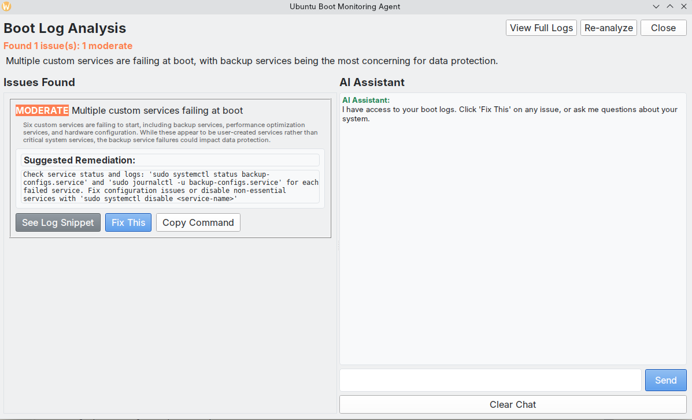
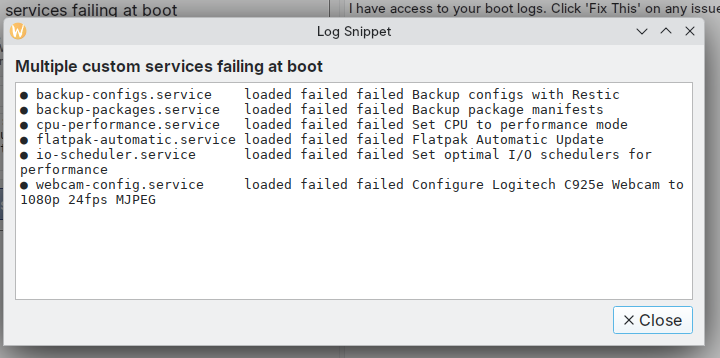
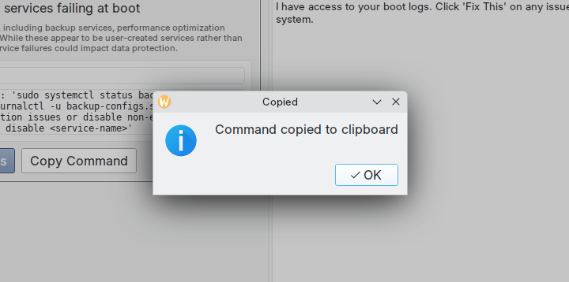
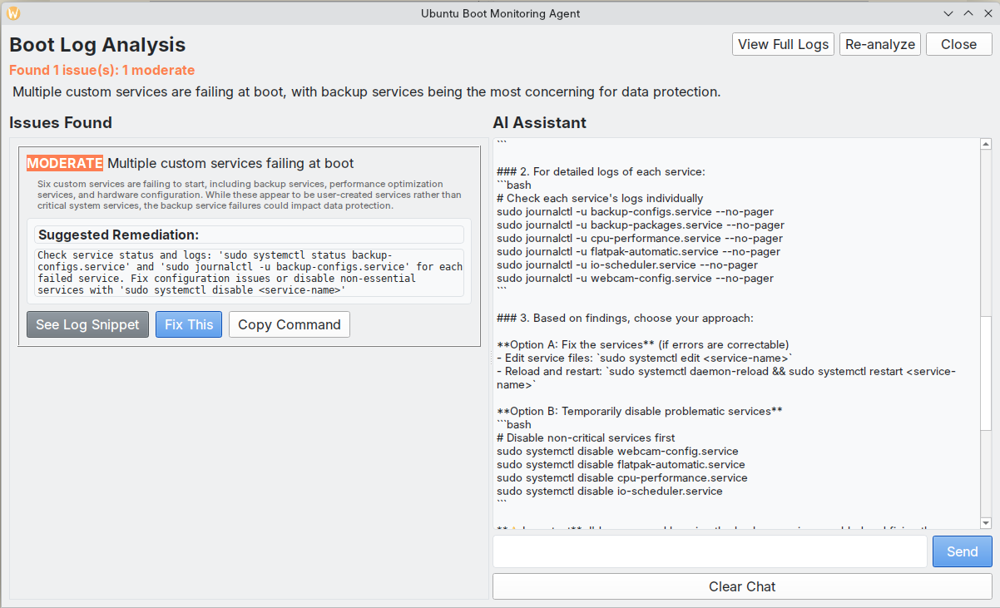
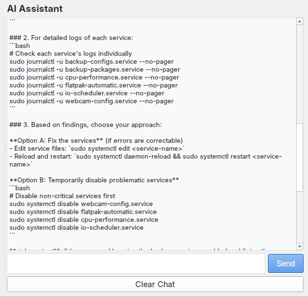
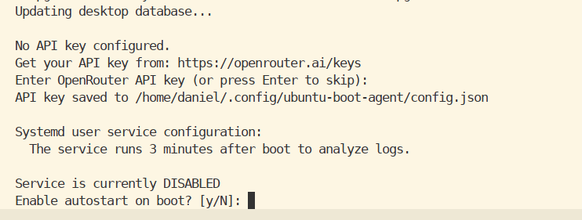
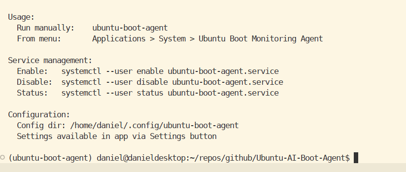

# Ubuntu Boot Monitoring Agent

Analyzes system logs after boot using an LLM (via OpenRouter) and flags issues that may need attention.

## What It Does

- Captures boot logs to a temporary file (cleared on reboot)
- Sends logs to an LLM for analysis
- Displays issues with severity levels (Critical/High/Moderate/Low)
- Provides suggested remediation commands
- Optional: execute fixes directly or copy commands
- Chat interface to ask follow-up questions about logs

## Screenshots















## Installation

```bash
# Clone the repository
git clone https://github.com/danielrosehill/Ubuntu-AI-Boot-Agent.git
cd Ubuntu-AI-Boot-Agent

# Run the installer
./install.sh
```

The installer will prompt for an OpenRouter API key and optionally enable the systemd service.

## Usage

**Run manually:**
```bash
ubuntu-boot-agent
```

**From menu:**
Applications > System > Ubuntu Boot Monitoring Agent

**Service management:**
```bash
# Enable autostart
systemctl --user enable ubuntu-boot-agent.service

# Disable autostart
systemctl --user disable ubuntu-boot-agent.service

# Check status
systemctl --user status ubuntu-boot-agent.service
```

## Configuration

Configuration is stored in `~/.config/ubuntu-boot-agent/config.json`

Settings can be modified via the Settings button in the application.

## Requirements

- Ubuntu Linux
- Python 3.12+
- PyQt6
- OpenRouter API key

## How It Works

The systemd service runs 3 minutes after boot. Boot logs are captured to a temp file (cleared on reboot), sent to the LLM for analysis, and results are displayed in the GUI.

## Author

Daniel Rosehill (public@danielrosehill.com)
